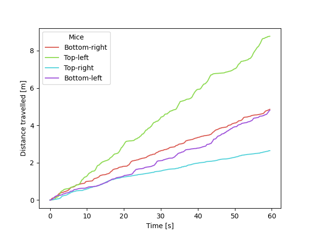
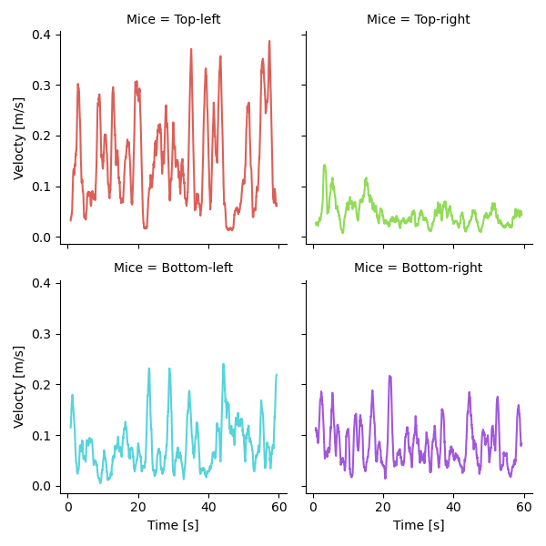

# DLC processor

This python code is designed to process data obtained from pose estimation
tracking of mouse behavior in an Open Maze test by 
[DeepLabCut](https://github.com/DeepLabCut/DeepLabCut).
Below are the measurements that this script currently measure:

1. Locomotion
2. Linear velocity
3. Angular velocity
4. Rotational behavior
5. Time spent in quadrants

## How to download source code
This tool requires Python>=3.7 and several dependent modules. You may download
its source code using git or wget using the following code in terminal:
```bash
# Using git
git clone https://github.com/fursham-h/DLCprocess.git
# or if you have SSH setup
# git clone git@github.com:fursham-h/DLCprocess.git

# Using wget
wget https://github.com/fursham-h/DLCprocess/archive/main.zip -O DLCprocess.zip
unzip DLCprocess.zip
mv DLCprocess-main DLCprocess   #drop branch name
```

Alternatively, you may click the `Code` button above to Download the zip file, 
unzip the contents and rename the folder to `DLCprocess`.

## How to install dependencies
To install the dependencies, open terminal and run the setup.py script:
```bash
cd DLCprocess       # or path to DLCprocess
python setup.py install
```

## Running the script
This repository contain a sample data in H5 format. To process this data using
the code, simply run the following in terminal:
```bash
python scripts/processDLC.py testdata/trackeddata.h5

```

You may replace `testdata/trackeddata.h5` with the path to your input data. This
tool can be fine-tuned by changing input parameters. A list of arguments can be
printed on terminal by running:
```bash
python scripts/processDLC.py -h
```

## Output 
This script will plot out figures from the different measurements, as an
interactive pyplot. You may save these images using the export tool. Below are
some examples of output plots:

<p align="left">
  
  
</p>

The measurements will also be saved as a tsv file to the current working directory
as `DLCprocess.tsv` by default. 

## Reporting bugs and issues
If you encounter a bug with the source code, please file an issue on 
[GitHub](https://github.com/fursham-h/DLCprocess/issues).

